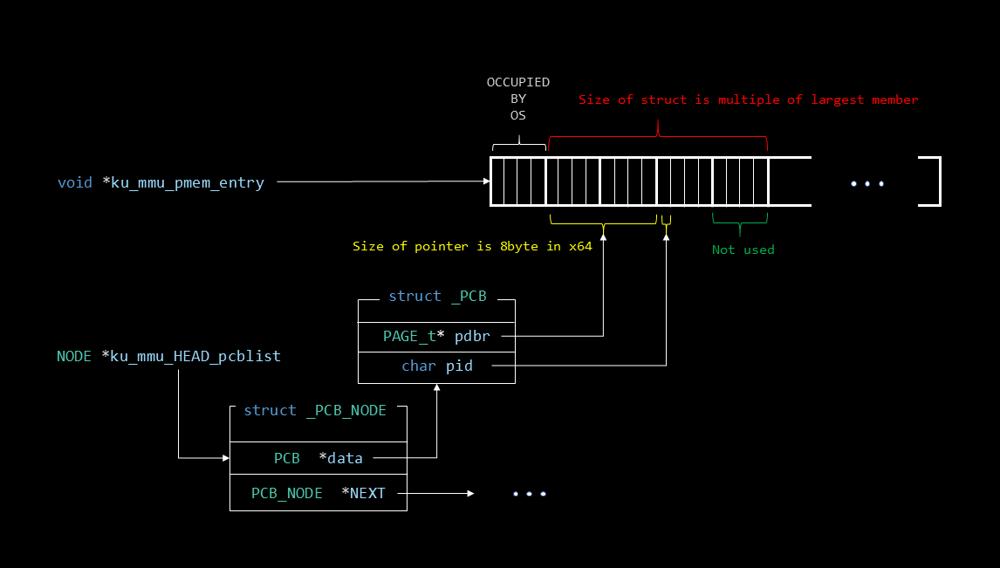
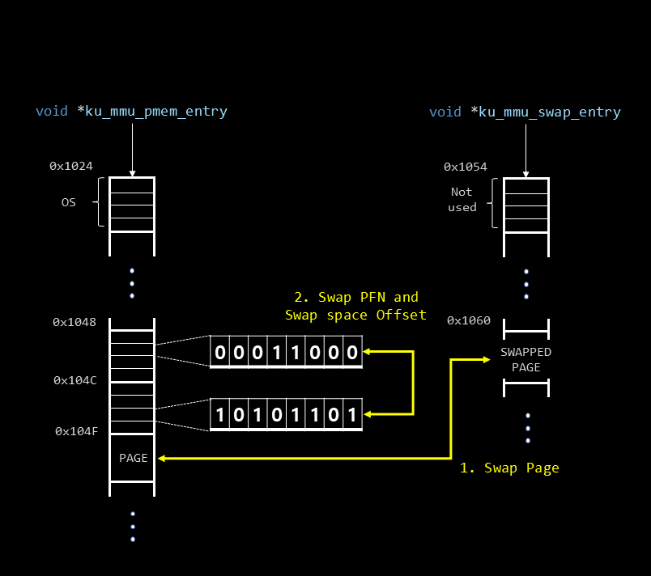

# KU_MMU

Implementation of Memory Management Unit at application level  
Assignment in Konkuk Univ. Operating System class by Prof. Hyun-Wook Jin

---
   
## Introduction

Due to the requirements of assignment, every variables and functions are written in single file: [ku_mmu.h](./ku_mmu.h). Which is a huge violation of modern software architecture :(

 

Application-level implementation of Memory Management Unit.

Converts given virtual address with PID to physical address in [input.txt](./input.txt)

- **8-bit** addressing: **256B** of address space
- Page size: 4B
- PDE/PTE: 1B

---

## Data Structures

### PCB List

 

### Memory Free list

### Init status

 

### Mapped memory

    
   
### Swap out   
  
- Swap space has free memory (default)

- Swap space is full

---

## Run

`$ ku_cpu <input_file> <pmem_size> <swap_size>`
